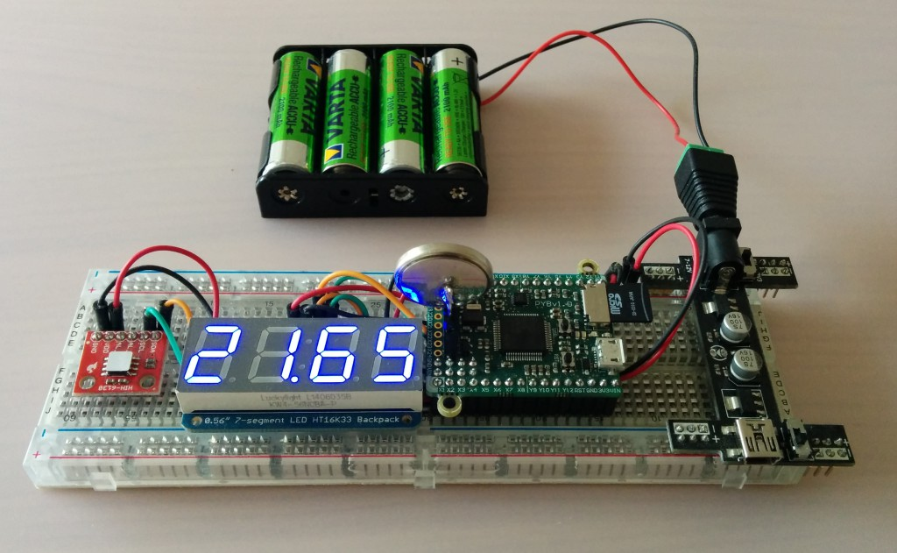
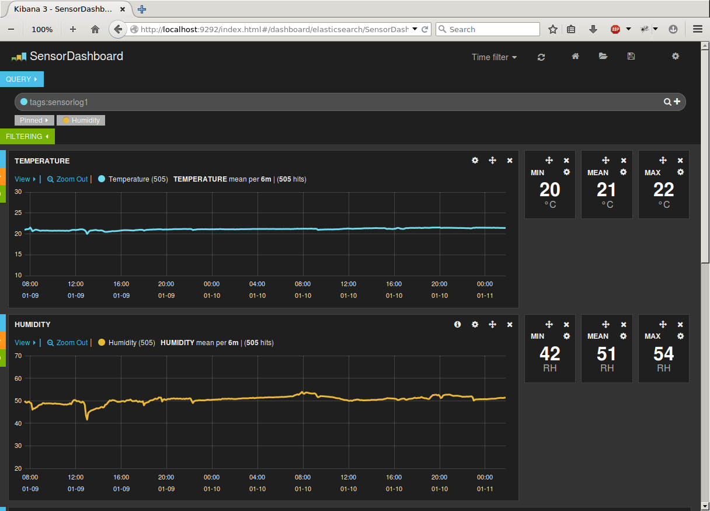

sensor
======

Humidity and temperature logger on Micro Python PYB v1.0

The humidity and temperature is recorded periodically (every 5 minutes) to a log file on the SD card.

## Micro Python data logger

Required hardware:
- Micro Python PYB v1.0
- Adafruit HIH6130 Humidity Sensor Breakout
- Adafruit 7-segment LED HT16K33 backpack

Source code: [micropython](micropython)

## Kibana Dashboard

Elasticsearch, Logstash and Kibana can be used to visualize the log data:

Usage on Debian Wheezy 7.8:

    $ git clone https://github.com/tinytux/sensor.git 
    $ cd sensor/dashboard
    $ ./start.sh
    $ ./feedlogs.sh ./logdata/logdata.txt

Source code: [dashboard](dashboard)

